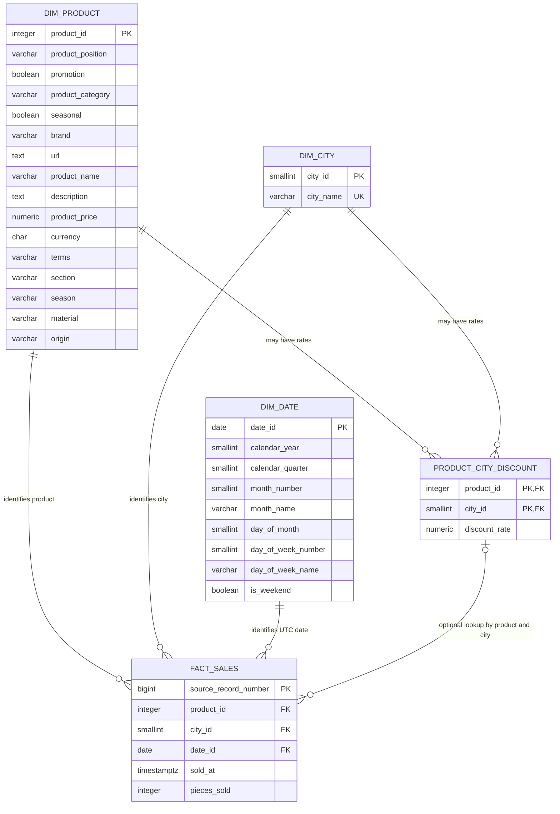

# Data Model and Business Rules

## Purpose

The `retail_sales` schema supports the three questions in the supplied coding challenge while preserving the source data's actual grain and limitations. The model separates descriptive product and calendar attributes from sales observations and from the undated product-city discount lookup.

The design has four priorities:

1. Preserve every valid sales source record without inventing a transaction key.
2. Prevent duplicate discount rows from multiplying sales during analysis.
3. Keep source discount mappings distinguishable from the analytical default of zero.
4. Make the limits of price, discount, and timestamp data explicit.

The executable DDL is [`sql/schema.sql`](../sql/schema.sql). An externally hosted version of the relationship diagram is also available on [dbdiagram.io](https://dbdiagram.io/d/Retail_sales-6ab04e01943b561dd496d9cf).

## Source contracts

| Source | Observed grain | Rows | Warehouse use |
|---|---|---:|---|
| `data/product_information.csv` | One row per product | 20,252 | `dim_product` |
| `data/products_sold.csv` | One recorded sales observation | 1,010,492 | `fact_sales` and `dim_date` |
| `data/discount.csv` | Intended as one row per product and city | 185,962 | `product_city_discount` and `dim_city` |

Observed source facts:

- Product IDs are complete and unique in the catalogue.
- Sales contain 66,929,370 units across ten cities.
- Sales timestamps cover 2025-01-01 00:00:04 through 2025-11-29 23:59:10 UTC.
- Discounts contain 184,121 unique product-city mappings plus 1,841 exact repeated rows.
- No product-city pair has conflicting rates in the supplied extract.
- Every supplied sales pair currently has a discount mapping, although the model permits future unmatched pairs.
- All supplied prices are USD.

## Relationship diagram



`fact_sales` has no foreign key to `product_city_discount`. A sale may legitimately have no source mapping; analytical SQL treats that missing rate as zero. The diagram's final relationship is therefore a logical optional lookup, not a database constraint.

## Table specifications

### `dim_product`

**Grain:** one row per catalogue product. **Primary key:** `product_id`, using the supplied natural key.

| Column | Source | Meaning and rule |
|---|---|---|
| `product_id` | `Product ID` | Positive integer; unique and required |
| `product_position` | `Product Position` | Required descriptive attribute |
| `promotion` | `Promotion` | Exact `Yes`/`No` converted to Boolean |
| `product_category` | `Product Category` | Required category; currently always `clothing` |
| `seasonal` | `Seasonal` | Exact `Yes`/`No` converted to Boolean |
| `brand` | `brand` | Required product brand |
| `url` | `url` | Required source URL stored as text |
| `product_name` | `name` | Nullable; one supplied value is missing |
| `description` | `description` | Nullable; two supplied values are missing |
| `product_price` | `price` | Positive two-decimal product price |
| `currency` | `currency` | Three uppercase characters; supplied data is USD |
| `terms` | `terms` | Required source classification |
| `section` | `section` | Required; used by Task 1 |
| `season` | `season` | Required; used by Task 1 |
| `material` | `material` | Required descriptive attribute |
| `origin` | `origin` | Required descriptive attribute |

The table is a current snapshot. There are no effective dates from which to build a slowly changing product dimension.

### `dim_city`

**Grain:** one row per distinct city appearing in either discounts or sales. **Primary key:** generated `city_id`. **Natural key:** unique `city_name`.

Discount cities are assigned IDs in alphabetical order. If a future sale introduces a city absent from the discount source, it is appended in first-seen sales order. The identity sequence is synchronized after loading because the pipeline supplies the generated IDs explicitly.

### `dim_date`

**Grain:** one row per calendar date from the earliest through the latest accepted sale. **Primary key:** `date_id`.

The dimension is continuous, including dates with no sales, and contains year, quarter, month, day, ISO weekday, weekday name, and weekend flag. Date membership is based on the sales timestamp interpreted in UTC.

### `fact_sales`

**Grain:** one row per accepted record in `products_sold.csv`. **Primary key:** `source_record_number`.

| Column | Meaning and rule |
|---|---|
| `source_record_number` | One-based CSV data-record number, excluding the header |
| `product_id` | Required reference to `dim_product` |
| `city_id` | Required reference to `dim_city` |
| `date_id` | UTC calendar date, referencing `dim_date` |
| `sold_at` | Complete source Unix timestamp represented as `TIMESTAMPTZ` |
| `pieces_sold` | Positive integer quantity |

`source_record_number` is a lineage key for this full-refresh pipeline. It is not claimed to be a transaction ID, invoice number, or stable business identifier. The observed uniqueness of `(product_id, city_id, sold_at)` is not imposed as a constraint because the source provides no business guarantee that two identical observations are duplicates.

### `product_city_discount`

**Grain:** one supplied discount mapping per product and city after exact deduplication. **Primary key:** `(product_id, city_id)`.

| Column | Meaning and rule |
|---|---|
| `product_id` | Required reference to `dim_product` |
| `city_id` | Required reference to `dim_city` |
| `discount_rate` | Fractional rate from 0 through 1, with up to four decimal places |

The table remains source-faithful:

- Exact repeated rows are reduced to one mapping.
- Conflicting rates for one product-city pair fail validation.
- Valid mappings with no current sales are retained.
- Missing mappings are not materialized as artificial zero rows.
- The source provides no effective or expiry dates, so discount history is not modeled.

## Source-to-target flow

```text
product_information.csv
    -> validate product keys, types, required values, and price
    -> dim_product

discount.csv
    -> validate product references and fractional rates
    -> remove exact repeated mappings
    -> fail on conflicting mappings
    -> product_city_discount

products_sold.csv
    -> validate product reference, quantity, city, and Unix timestamp
    -> retain each accepted source record
    -> fact_sales
    -> derive continuous dim_date

discount cities UNION sales cities
    -> dim_city
```

CSV parsing is name-based and quote-aware. The exact required header-name set is enforced, but column order may vary. Surrounding whitespace is trimmed; internal text is preserved.

## Business definitions and assumptions

### Sales measures

- **Unit sales volume:** `SUM(pieces_sold)`.
- **Assumed gross sales value:** `SUM(pieces_sold * product_price)`.
- **Assumed net sales value:** `SUM(pieces_sold * product_price * (1 - effective_discount_rate))`.
- **Effective discount rate:** `COALESCE(product_city_discount.discount_rate, 0)`.

The monetary measures are analytical estimates, not recorded revenue. `product_price` is a product attribute, not a transaction-time price, and the source has no transaction-level price history.

### Discount semantics

Discount availability is defined at `(product_id, city_id)` grain:

```text
source mapping exists with rate 0     -> explicit zero discount
source mapping exists with rate > 0   -> use that rate
source mapping does not exist          -> use zero in analysis
```

The latter case uses a `LEFT JOIN` and `COALESCE`; it does not create a row in `product_city_discount`. This preserves the distinction between supplied facts and analytical defaults.

Because rates are undated, analyses assume the supplied mapping applies to all observed timestamps. That assumption cannot be validated from these files and must not be presented as historical discount evidence.

### Challenge interpretations

- **Task 1:** filter `section = 'WOMAN'` and `season = 'Winter'`; group unit volume and assumed net value by city.
- **Task 1b:** calculate each city's maximum rate across all supplied product mappings, defaulting a city with no mappings to zero; apply the rate to the same qualifying quantities and product prices.
- **Task 2:** rank the full product catalogue by total units, retain all ties, and use a left join so a catalogue product with no sales would remain eligible for the worst-selling group.

Task 1b is a fixed-quantity arithmetic scenario. It is not a forecast of demand, revenue, margin, or customer response.

## Integrity and loading guarantees

The pipeline prepares all source data before changing PostgreSQL. A malformed or ambiguous required value stops the batch, and the existing warehouse contents remain untouched.

The database refresh then runs as one transaction:

1. Truncate the five challenge tables.
2. Bulk load prepared files using PostgreSQL `COPY`.
3. Synchronize the city identity sequence.
4. Reconcile prepared and loaded table counts.
5. Reconcile total `pieces_sold`.
6. Left-join sales to discounts and verify that row count and units are unchanged.
7. Reconcile the informational counts of unmatched sales and unmatched product-city pairs.
8. Commit only if every check passes; otherwise roll back the complete refresh.

Schema DDL is applied in a separate transaction before the data refresh. The process is therefore an atomic data refresh, not an atomic schema-and-data deployment.

## Verified current load

| Table | Rows |
|---|---:|
| `dim_product` | 20,252 |
| `dim_city` | 10 |
| `dim_date` | 333 |
| `product_city_discount` | 184,121 |
| `fact_sales` | 1,010,492 |

The loaded sales quantity reconciles to 66,929,370 units. The current source has zero unmatched sales discount mappings. A disposable PostgreSQL integration test also verifies that future missing mappings remain valid, calculate as zero when queried, and do not create synthetic discount rows.

## Limitations

- There is no transaction or invoice identifier.
- Product price is not captured at sale time.
- Discount rates have no effective dates or history.
- Product attributes have no version history.
- All current prices are USD; currency conversion and future mixed-currency aggregation are outside the challenge scope.
- November 2025 ends on the 29th and December is absent, so monthly comparisons do not represent a complete year.
- The full-refresh lineage key assumes one complete sales file per run; an incremental multi-file design would need a durable source identifier.

These limits are documented rather than filled with invented data or unsupported causal claims.
